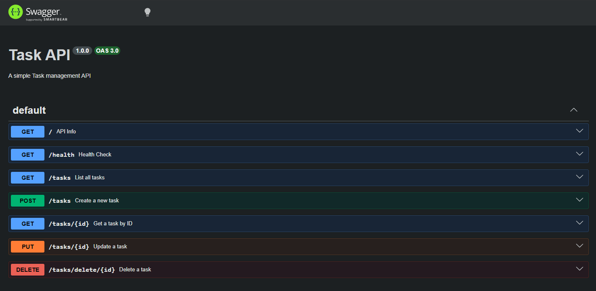

# Task API

A simple RESTful API for managing tasks built with Express.js.

## Installation

```bash
npm install
```

## Run

```bash
npm run dev
```

## Endpoints

| Method | Endpoint | Description |
|--------|----------|-------------|
| GET | / | API info |
| GET | /health | Health check |
| GET | /tasks | List all tasks |
| GET | /tasks/:id | Get task by ID |
| POST | /tasks/new | Create new task |
| PUT | /tasks/update/:id | Update task |
| DELETE | /tasks/delete/:id | Delete task |

## Example

```bash
curl -i http://localhost:3000/health
```

```
HTTP/1.1 200 OK
X-Powered-By: Express
Content-Type: application/json; charset=utf-8
Content-Length: 15
ETag: W/"f-VaSQ4oDUiZblZNAEkkN+sX+q3Sg"
Date: Wed, 15 Jul 2026 14:58:04 GMT
Connection: keep-alive
Keep-Alive: timeout=5

{"status":"ok"}
```
